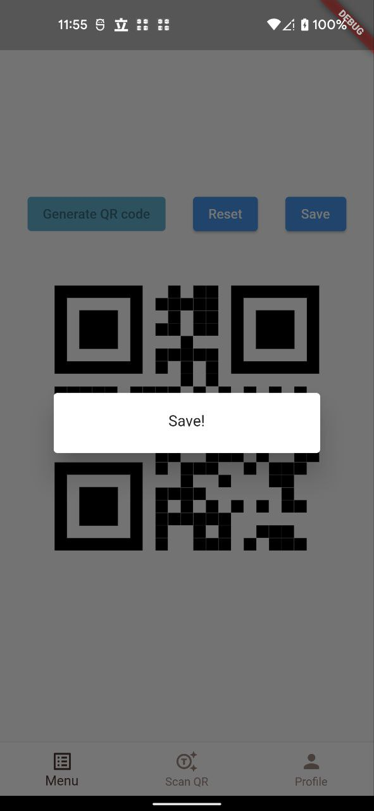

# ryougoku

This is Flutter example about simple authentication with Auth0 and generate random QR code.


## Environment setup

- Use need to create a `.env.development` file and fill the parameters.
- Install libraries
```
flutter pub get
```

## Stacks

Below is stack I used and linked I consulted
### Go_router

- Manage route of app.
- [Documentation](https://gorouter.dev/)
- Go_router is quite easy to use. I just have stuck with the integration to riverpod. That is a basic go_router usage, though.
- This is good [discussion](https://github.com/rrousselGit/riverpod/discussions/1357) that you can read.

### Riverpod

- Manage state of app.
- [Documentation](https://riverpod.dev/docs/getting_started)
- In the first time, I used provider but when heard that riverpod is much more convenient, I changed to riverpod. Even so, I think riverpod is not the best choice to manage state. I will try [Bloc](https://bloclibrary.dev/#/) in the future if I have time.

### Auth0

- Authentication integration
- [Blog](https://auth0.com/blog/flutter-authentication-authorization-with-auth0-part-1-adding-authentication-to-an-app/) for add auth0 to the app.

## Others

### QR Code

- [Good post](https://itnext.io/qr-code-in-flutter-9b7072343598) about QR Code handlers.
- This example just scan QR code, display it and random generate a QR code.
- I also want to try send request when a QR code is scanned and save a generated QR code. (Just note here for memo)

## Result Images

<p align="middle">
 


</p>
<p align="middle">


</p>

